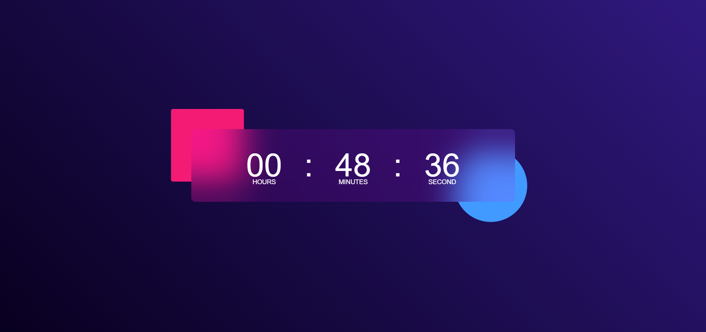

# ⏰ Digital Clock

A simple Digital Clock built using HTML, CSS, and JavaScript.
This project dynamically displays the current time and updates every second.

## 🚀 Features

Displays hours, minutes, and seconds in real-time

Updates automatically every second

Clean and responsive design

Built with vanilla JavaScript (no external libraries)

## 🛠️ Technologies Used

HTML5 – Structure of the clock

CSS3 – Styling and responsiveness

JavaScript (ES6) – Logic to update time dynamically

## 📸 Demo Screenshot

📂 Project Structure
Digital-Clock/
│── index.html
│── style.css
│── README.md

## ⚡ How to Run Locally

- Clone this repository

- git clone https://github.com/tech1tarun/Digital-Clock.git

- Navigate to the project folder

- cd digital-clock

- Open index.html in your browser

### 🎯 Future Improvements

- Adding AM/PM format toggle

- Adding Dark/Light theme switch

- Show date and day

### 🤝 Contributing

Contributions are welcome! If you’d like to improve the project, feel free to fork the repo and create a pull request.
